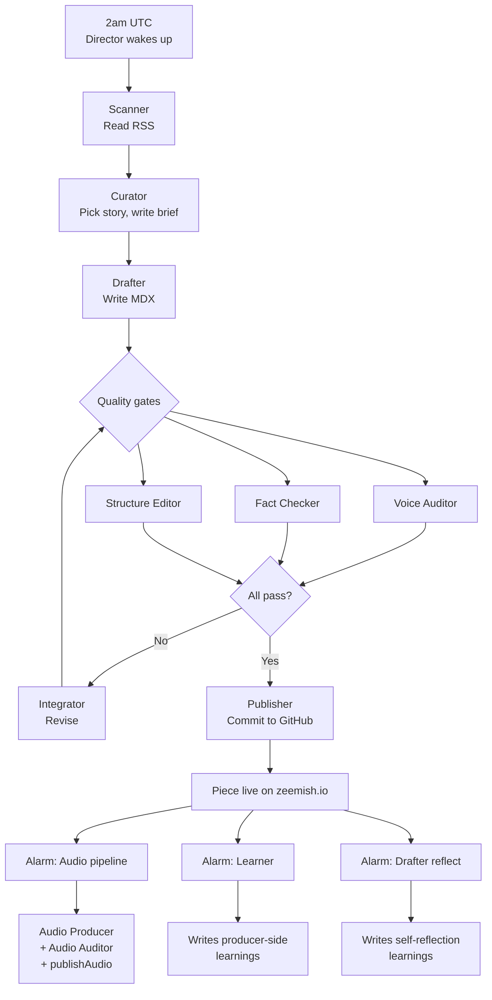

# 10 — A day in the life of a piece

Chapter 9 introduced the thirteen roles. This chapter watches them work together, start to finish, on one piece.

The piece we'll follow is `2026-04-19 — Why Jet Fuel Price Spikes Break Some Airlines and Not Others`. It really shipped. The timeline below is what actually happened.

## The flow, at a glance

Each arrow is a handoff. Each box is a role. Observer is logging everything throughout, to the side, so the dashboard can show what happened later.

## Minute by minute

**02:00:00 UTC.** Cloudflare's scheduler wakes Director. Director is a Durable Object — small program that lives on Cloudflare and can be "woken up" on a schedule.

**02:00:03.** Director calls Scanner. Scanner fetches six RSS feeds in parallel: Reuters, AP, BBC, Axios, others. It takes about three seconds.

**02:00:10.** Scanner has 64 stories. It deduplicates — some stories appeared in multiple feeds. Down to 50 unique candidates. Scanner writes all 50 to the `daily_candidates` table. Returns control to Director.

**02:00:12.** Director calls Curator. Curator reads all 50 candidate rows from `daily_candidates`, plus the last 30 days of published pieces (for a basic sense of what has recently been covered). Sends this plus a prompt to Claude:

> *You are Zeemish's Curator. Pick the most teachable story from these 50 candidates — the one where there's a real underlying system worth explaining, not just a headline. Write a brief: what the story is, what the underlying system is, what angle the piece should take, what beats it should have.*

**02:00:25.** Claude returns the brief. Curator has picked the Axios story about airlines cutting routes after a jet fuel spike. The angle is "why some airlines break under commodity shocks while others adjust." The brief names eight potential beats. Curator writes the brief to storage and hands control to Director.

**02:00:27.** Director calls Drafter. Drafter loads:
- The brief from Curator
- The voice contract from `content/voice-contract.md`
- The ten most recent learnings from the `learnings` table
- A base prompt that explains the piece format

Drafter sends everything to Claude with an instruction: *write the piece.*

**02:00:55.** Claude returns about 1,400 words of draft, already formatted with beat headings and frontmatter. Drafter parses it, validates the frontmatter, and hands it to Director.

**02:00:57.** Director kicks off the quality gates. Three auditors run in parallel (each is a separate Claude call):

- **Voice Auditor** — "Check this draft against the voice contract. Score it out of 100."
- **Fact Checker** — "Extract the factual claims. Mark each as verified, unverified, or incorrect."
- **Structure Editor** — "Check the beat count, hook length, close length, overall flow."

**02:01:15.** All three return. Voice Auditor scored 92. Fact Checker found seven claims, flagged six as unverified (the DDG search returned nothing) and none as incorrect. Structure Editor passed — six beats, hook on one screen, close on one sentence.

All three pass. No revision needed. This piece was a "one-round" piece, which the dashboard will eventually show as `1 round` in its recent runs list.

**02:01:17.** Director calls Publisher. Publisher writes the MDX file to `content/daily-pieces/2026-04-19-airline-industry-faces-a-shakeup-as-jet-fuel-hits-hard.mdx`, then commits it to GitHub with the message:

> `feat(daily): publish 2026-04-19 piece on airline fuel shocks`

**02:01:19.** GitHub Actions fires. It rebuilds the site. About two minutes later, the piece is live at `zeemish.io/daily/2026-04-19/`. At this point, the text side of the day is done.

**02:01:20.** Director schedules three alarms:
- Audio pipeline in 2 seconds
- Learner (post-publish analysis) in 1 second
- Drafter reflection in 1 second

Why alarms? Because Durable Objects have a limit on how long one "call" can run. The audio pipeline takes a few minutes. Learner and Reflection take about 30 seconds each. Doing them all inline would exceed the budget. So Director schedules them and returns, and each one runs in its own fresh execution later.

**02:01:21.** Learner fires. Reads:
- The piece's full audit history (one round, all passed)
- The pipeline log (timings)
- The 50 candidates (including the 49 that were not picked)

Sends this to Claude with a prompt asking for observations about patterns visible in this publish. Claude returns three short observations. Learner writes them to the `learnings` table with `source='producer'`.

**02:01:21 (same second).** Drafter-reflection fires in parallel. Reads:
- The published MDX
- The original brief

Sends to Claude with a prompt asking the Drafter, honestly, what felt thin, what was stretching, which beat it rewrote most, what it would do differently. Claude returns 3–6 short bullets. Drafter-reflection writes them to `learnings` with `source='self-reflection'`.

**02:01:22.** Audio pipeline begins. Audio Producer reads the MDX. For each of the six beats (plus hook and close — actually six audio clips for this piece), sends the text to ElevenLabs. ElevenLabs returns an MP3. Each MP3 is uploaded to R2 and a record is written to `daily_piece_audio`.

This is the slow part. Each beat takes 10–15 seconds to generate. Six clips means two to three minutes total, though due to Durable Object time limits the audio pipeline runs in "chunks" — two beats per chunk, rescheduled via alarm.

**02:03:40.** All six clips done. Audio Auditor runs. Checks each R2 object exists and is a reasonable size. Passes.

**02:03:42.** Publisher runs a second time — this is the audio second-commit. It adds an `audioBeats` map to the MDX frontmatter (just metadata, the body isn't touched), and commits again. GitHub Actions fires. The site rebuilds.

**02:06:00 or so.** The audio player on the piece page now works. Anyone reading the piece can hit play and listen.

## The whole thing, in under six minutes

From Director waking up at 02:00:00 to the audio being live around 02:06:00, about six minutes have passed. A piece has been researched, picked, written, audited, published, narrated, and archived. All without a human involved.

The cost was roughly:
- About 7 Claude calls (curator + drafter + 3 auditors + learner + reflection), costing a few cents each.
- 6 ElevenLabs voice generations, costing a few cents each.
- A bit of D1 storage, a bit of R2 storage, near-zero compute.

For under a dollar, one daily teaching piece was produced, audited for quality, and published with audio narration.

## What happens if something goes wrong

A lot of the chapters in the followups folder of this book will eventually be about failure modes. Briefly:

- If a Claude call fails (network error, rate limit), the caller retries once or twice and then escalates to Observer.
- If a quality gate fails, Integrator tries to fix it. Three rounds max, then escalation.
- If audio fails midway, the pipeline can be resumed from where it stopped via the admin panel's Continue button.
- If anything goes catastrophically wrong, the text publishes anyway (that's the "newspaper never skips a day" principle) and audio lands later or not at all.

The design point: text publication is the hard deadline. Everything else degrades gracefully around it. A day without a piece is worse than a day with a piece but no audio.

## If you remember one thing

The pipeline is linear in the happy path — one thing after another. The interesting complexity lives in the quality gates, the alarms, and the post-publish learning. Chapter 14 is about the last part.
